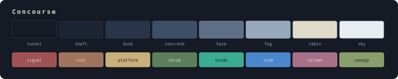

# Concourse

overcast vibes with urban warmth

## Colors

### Neutrals

| Name | Hex | Role |
|------|-----|------|
| tunnel | `#151A24` | Darkest background |
| shaft | `#1D2535` | Default background |
| dusk | `#2A3448` | Selection, highlights |
| concrete | `#3D4F66` | Comments, inactive |
| haze | `#5E7088` | Secondary text |
| fog | `#96A8BC` | Default foreground |
| cabin | `#E0DAC8` | Bright foreground |
| sky | `#E8EDF2` | Light background |

### Accents

| Name | Hex | Role |
|------|-----|------|
| signal | `#A05252` | Red |
| rust | `#A0745C` | Orange |
| platform | `#C8B07A` | Yellow |
| shrub | `#5B7F59` | Green |
| oxide | `#3AAC92` | Cyan |
| tide | `#4A86CC` | Blue |
| column | `#A87088` | Magenta |
| canopy | `#8A9E6C` | Brown |

## Installation

### KDE Plasma
Copy `Concourse.colors` to `~/.local/share/color-schemes/` and apply via System Settings → Colors.

### Konsole
Copy `Concourse.colorscheme` to `~/.local/share/konsole/` and select it in your profile settings.

### Base16 / Flavours
Use `concourse.yaml` as your scheme file with any Base16-compatible tooling.

## License

MIT
